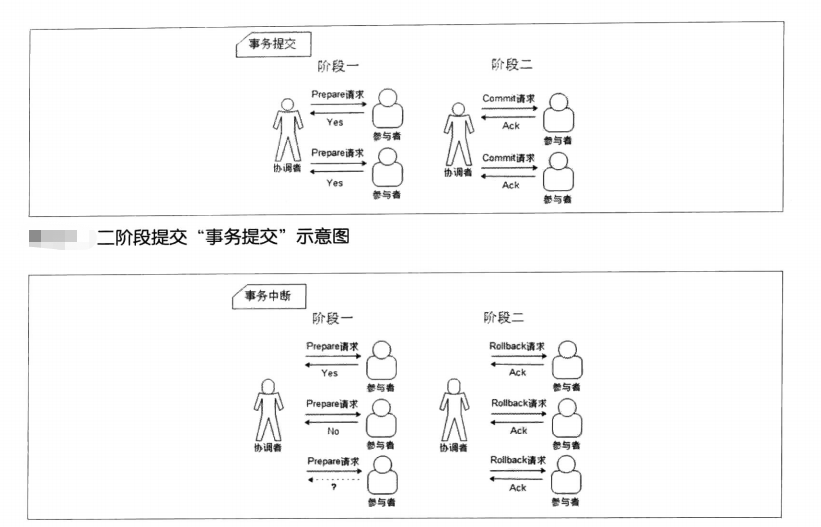

# 分布式理论
## CAP
CAP定理讲的是三个性。consistency数据一致性，availability可用性，partition tolerance分区容错性。

三者只能选其中两者。为什么呢，看看这三个性质意味着什么吧。

首先看看分区容错性，分区容错性指的是网络出现分区（丢包，断网，超时等情况都属于网络分区）时，整个服务仍然可用。

由于网络分区在实际环境下一定存在，所以必须首先被考虑。于是分区容错性是必须要保证的，否则一旦出现分区服务就不可用，那就没办法弄了。

所以实际上是2选1的问题。在可用性和一致性中做出选择。

在一个分布式环境下，多个节点一起对外提供服务，如果要保证可用性，那么一台机器宕机了仍然有其他机器能提供服务。
但是宕机的机器重启以后就会发现数据和其他机器存在不一致，那么一致性就无法得到保证。

如果保证一致性，如果有机器宕机，那么其他节点就不能工作了，否则一定会产生数据不一致。

## BASE

在这么严苛的规定下，CAP一般很难实现一个健壮的系统。于是提出了BASE来削弱这些要求。

BASE是基本可用basically available，soft state软状态，eventually consistent最终一致性。

基本可用就是允许服务在某些时候降级，比如淘宝在高峰时期会关闭退货等服务。

软状态就是允许数据出现中间状态，比如支付宝提交转账以后并不是立刻到账，中间经过了多次消息传递和转发。

最终一致性就是指数据最终要是一致的，比如多个节点的数据需要定期同步，支付宝转账最终一定会到账。

## 一致性协议

### 2CP协议

- 阶段一：提交事务请求

1. 事务询问
协调者向所有的参与者发送事务内容，询问是否可以执行事务提交操作，并开始等待各参与者的响应

2. 执行事务。
各参与者节点执行事务操作，并将Undo和Redo信息记入事务日志中

3. 各参与者向协调者反馈事务询问的响应

如果参与者成功执行了事务操作，那么就反馈给协调者Yes响应，表示事务可以执行；如果参与者没有成功执行事务，那么就反馈给协调者No响应，表示事务不可以执行。
由于上面讲述的内容在形式上近似是协调者组织各参与者对一次事务操作的投票表态过程，因此二阶段提交协议的阶段一也被称为“投票阶段”，即各参与者投票表明是否要继续执行接下去的事务提交操作。

- 阶段二：执行事务提交

在阶段二中，协调者会根据各参与者的反馈情况来决定最终是否可以进行事务提交操作，正常情况下，包含以下两种可能。
1. 执行事务提交
假如协调者从所有的参与者获得的反馈都是Yes响应，那么就会执行事务提交。

2. 发送提交请求

协调者向所有参与者节点发出Commit请求。
3. 事务提交。
参与者接收到Commit请求后，会正式执行事务提交操作，并在完成提交之后释放在整个事务执行期间占用的事务资源。
4. 反馈事务提交结果。
参与者在完成事务提交之后，向协调者发送Ack消息。
5. 完成事务。
协调者接收到所有参与者反馈的Ack消息后，完成事务。

- 阶段二：中断事务

假如任何一个参与者向协调者反馈了No响应，或者在等待超时之后，协调者尚无法接收到所有参与者的反馈响应，那么就会中断事务。
1. 发送回滚请求。
协调者向所有参与者节点发出Rollback请求。
2. 事务回滚。
参与者接收到Rollback请求后，会利用其在阶段一中记录的Undo信息来执行事务回滚操作，并在完成回滚之后释放在整个事务执行期间占用的资源。
3. 反馈事务回滚结果。
参与者在完成事务回滚之后，向协调者发送Ack消息。
4. 中断事务。
协调者接收到所有参与者反馈的Ack消息后，完成事务中断。

- 优缺点

二阶段提交协议的优点：原理简单，实现方便。

二阶段提交协议的缺点：同步阻塞、单点问题、脑裂、太过保守。

1. 同步阻塞

二阶段提交协议存在的最明显也是最大的一个问题就是同步阻塞，这会极大地限制分布式系统的性能。在二阶段提交的执行过程中，所有参与该事务操作的逻辑都处于阻塞状态，也就是说，各个参与者在等待其他参与者响应的过程中，将无法进行其他任何操作。

2. 单点问题
在上面的讲解过程中，相信读者可以看出，协调者的角色在整个二阶段提交协议中起到了非常重要的作用。一旦协调者出现问题，那么整个二阶段提交流程将无法运转，更为严重的是，如果协调者是在阶段二中出现问题的话，那么其他参与者将会一直处于锁定事务资源的状态中，而无法继续完成事务操作。

3. 数据不一致
在二阶段提交协议的阶段二，即执行事务提交的时候，当协调者向所有的参与者发送Commit请求之后，发生了局部网络异常或者是协调者在尚未发送完Commit 请求之前自身发生了崩溃，导致最终只有部分参与者收到了Commit请求。于是，这部分收到了Commit请求的参与者就会进行事务的提交，而其他没有收到Commit请求的参与者则无法进行事务提交，于是整个分布式系统便出现了数据不一致性现象。

4. 太过保守
如果在协调者指示参与者进行事务提交询问的过程中，参与者出现故障而导致协调者始终无法获取到所有参与者的响应信息的话，这时协调者只能依靠其自身的超时机制来判断是否需要中断事务，这样的策略显得比较保守。换句话说，二阶段提交协议没有设计较为完善的容错机制，任意一个节点的失败都会导致整个事务的失败。

### 3CP协议

3PC，是Three-Phase Commit的缩写，即三阶段提交，是2PC的改进版，其将二阶段提交协议的“提交事务请求”过程一分为二，形成了由CanCommit、PreCommit和do Commit三个阶段组成的事务处理协议，其协议设计如图所示

#### 阶段一：CanCommit

1. 事务询问。
协调者向所有的参与者发送一个包含事务内容的canCommit请求，询问是否可以执行事务提交操作，并开始等待各参与者的响应。

2. 各参与者向协调者反馈事务询问的响应。
参与者在接收到来自协调者的canCommit请求后，正常情况下，如果其自身认为可以顺利执行事务，那么会反馈Yes响应，并进入预备状态，否则反馈No响应。

#### 阶段二：PreCommit

在阶段二中协调者会根据各参与者的反馈情况来决定是否可以进行事务的PreCommit操作，正常情况下，包含两种可能。

- 执行事务预提交
假如协调者从所有的参与者获得的反馈都是Yes响应，那么就会执行事务预提交。
1. 发送预提交请求。
协调者向所有参与者节点发出preCommit的请求，并进入Prepared阶段。
2. 事务预提交。
参与者接收到preCommit请求后，会执行事务操作，并将Undo和Redo信息记录到事务日志中。
3. 各参与者向协调者反馈事务执行的响应。
如果参与者成功执行了事务操作，那么就会反馈给协调者Ack响应，同时等待最终的指令：提交（commit）或中止（abort）。

- 中断事务
假如任何一个参与者向协调者反馈了No响应，或者在等待超时之后，协调者尚无法接收到所有参与者的反馈响应，那么就会中断事务。
1. 发送中断请求。
协调者向所有参与者节点发出abort请求。

2. 中断事务。
无论是收到来自协调者的abort请求，或者是在等待协调者请求过程中出现超时，参与者都会中断事务。

#### 阶段三：doCommit

该阶段将进行真正的事务提交，会存在以下两种可能的情况。

- 执行提交

- 中断任务

需要注意的是，一旦进入阶段三，可能会存在以下两种故障。
·协调者出现问题。
·协调者和参与者之间的网络出现故障。
无论出现哪种情况，最终都会导致参与者无法及时接收到来自协调者的doCommit或是abort请求，针对这样的异常情况，参与者都会在等待超时之后，继续进行事务提交。

- 优缺点

三阶段提交协议的优点：相较于二阶段提交协议，三阶段提交协议最大的优点就是降低了参与者的阻塞范围，并且能够在出现单点故障后继续达成一致。

三阶段提交协议的缺点：三阶段提交协议在去除阻塞的同时也引入了新的问题，那就是在参与者接收到preCommit消息后，如果网络出现分区，此时协调者所在的节点和参与者无法进行正常的网络通信，在这种情况下，该参与者依然会进行事务的提交，这必然出现数据的不一致性。

## 分布式系统关键词

### 时钟，时间，事件顺序  

分布式系统的一个问题在与缺少全局时钟，所以大家没有一个统一的时间，就很难用时间去确定各个节点事件的发生顺序，为了保证事件的顺序执行，

### Lamport timestamps

Leslie Lamport 在1978年提出逻辑时钟的概念，并描述了一种逻辑时钟的表示方法，这个方法被称为Lamport时间戳(Lamport timestamps)[3]。

分布式系统中按是否存在节点交互可分为三类事件，一类发生于节点内部，二是发送事件，三是接收事件。Lamport时间戳原理如下：

    每个事件对应一个Lamport时间戳，初始值为0
    如果事件在节点内发生，时间戳加1
    如果事件属于发送事件，时间戳加1并在消息中带上该时间戳
    如果事件属于接收事件，时间戳 = Max(本地时间戳，消息中的时间戳) + 1
    
这样的话，节点内的事件有序，发送事件有序，接收事件一定在发送事件以后发生。再加上人为的一些规定，因此根据时间戳可以确定一个全序排列。

### Vector clock

Lamport时间戳帮助我们得到事件顺序关系，但还有一种顺序关系不能用Lamport时间戳很好地表示出来，那就是同时发生关系(concurrent)[4]。
Vector clock是在Lamport时间戳基础上演进的另一种逻辑时钟方法，它通过vector结构不但记录本节点的Lamport时间戳，同时也记录了其他节点的Lamport时间戳[5][6]。

如果 Tb[Q] > Ta[Q] 并且 Tb[P] < Ta[P]，则认为a、b同时发生，记作 a <-> b。例如图2中节点B上的第4个事件 (A:2，B:4，C:1) 与节点C上的第2个事件 (B:3，C:2) 没有因果关系、属于同时发生事件。

因为B4 > B3并且 C1<C2，说明两者之间没有顺序关系，否则不会出现一大一小，因此他们是同时发生的。

### Version vector

基于Vector clock我们可以获得任意两个事件的顺序关系，结果或为先后顺序或为同时发生，识别事件顺序在工程实践中有很重要的引申应用，最常见的应用是发现数据冲突(detect conflict)。

 

分布式系统中数据一般存在多个副本(replication)，多个副本可能被同时更新，这会引起副本间数据不一致[7]，Version vector的实现与Vector clock非常类似[8]，目的用于发现数据冲突[9]。

当两个写入数据事件同时发生则发生了冲突，于是通过某些方法解决数据冲突。

Vector clock只用于发现数据冲突，不能解决数据冲突。如何解决数据冲突因场景而异，具体方法有以最后更新为准(last write win)，或将冲突的数据交给client由client端决定如何处理，或通过quorum决议事先避免数据冲突的情况发生[11]。

### 选主，租约，多数派

> 选举(election)是分布式系统实践中常见的问题，通过打破节点间的对等关系，选得的leader(或叫master、coordinator)有助于实现事务原子性、提升决议效率。
> 
> 多数派(quorum)的思路帮助我们在网络分化的情况下达成决议一致性，在leader选举的场景下帮助我们选出唯一leader。
> 
> 租约(lease)在一定期限内给予节点特定权利，也可以用于实现leader选举。

选举(electioin)

> 一致性问题(consistency)是独立的节点间如何达成决议的问题，选出大家都认可的leader本质上也是一致性问题，因而如何应对宕机恢复、网络分化等在leader选举中也需要考量。
> 
>  在一致性算法Paxos、ZAB[2]、Raft[3]中，为提升决议效率均有节点充当leader的角色。
>  
>  ZAB、Raft中描述了具体的leader选举实现，与Bully算法类似ZAB中使用zxid标识节点，具有最大zxid的节点表示其所具备的事务(transaction)最新、被选为leader。

多数派(quorum)

> 在网络分化的场景下以上Bully算法会遇到一个问题，被分隔的节点都认为自己具有最大的序号、将产生多个leader，这时候就需要引入多数派(quorum)[4]。多数派的思路在分布式系统中很常见，其确保网络分化情况下决议唯一。
 
 租约(lease)

选举中很重要的一个问题，以上尚未提到：怎么判断leader不可用、什么时候应该发起重新选举？
>   
> 最先可能想到会通过心跳(heart beat)判别leader状态是否正常，但在网络拥塞或瞬断的情况下，这容易导致出现双主。

 

租约(lease)是解决该问题的常用方法，其最初提出时用于解决分布式缓存一致性问题[6]，后面在分布式锁[7]等很多方面都有应用。
    
    (a). 节点0、1、2在Z上注册自己，Z根据一定的规则(例如先到先得)颁发租约给节点，该租约同时对应一个有效时长；这里假设节点0获得租约、成为leader
    
    (b). leader宕机时，只有租约到期(timeout)后才重新发起选举，这里节点1获得租约、成为leader

 

租约机制确保了一个时刻最多只有一个leader，避免只使用心跳机制产生双主的问题。在实践应用中，zookeeper、ectd可用于租约颁发。

## 一致性，2pc和3pc

一致性(consensus)

何为一致性问题？简单而言，一致性问题就是相互独立的节点之间如何达成一项决议的问题。分布式系统中，进行数据库事务提交(commit transaction)、Leader选举、序列号生成等都会遇到一致性问题。

为了保证执行的一致性，可以使用2pc两段式提交和3pc三段式提交。

2PC
> 
> 2PC(tow phase commit)两阶段提交[5]顾名思义它分成两个阶段，先由一方进行提议(propose)并收集其他节点的反馈(vote)，再根据反馈决定提交(commit)或中止(abort)事务。我们将提议的节点称为协调者(coordinator)，其他参与决议节点称为参与者(participants, 或cohorts)：

举个例子，首先用户想要执行一个事务，于是提交给leader，leader先让各个节点执行该事务。

我们要知道，事务是通过日志来实现的。各个节点使用redo日志进行重做，使用undo日志进行回滚。

于是各个节点执行事务，并把执行结果是否成功返回给leader，当leader收到全部确认消息后，发送消息让所有节点commit。如果有节点执行失败，则leader要求所有节点回滚。

2pc可能出现的一些问题是：

1 leader必须等待所有节点结果，如果有节点宕机或超时，则拒绝该事务，并向节点发送回滚的信息。

2 如果leader宕机，则一般配置watcherdog自动切换成备用leader，然后进行下一次的请求提交。

3这两种情况单独发生时都没有关系，有对应的措施可以进行回滚，但是如果当一个节点宕机时leader正在等待所有节点消息，其他节点也在等待leader最后的消息。

此时leader也不幸宕机，切换之后leader并不知道一个节点宕机了，这样的话其他的节点也会被阻塞住导致无法回滚。
> 
3PC

coordinator接收完participant的反馈(vote)之后，进入阶段2，给各个participant发送准备提交(prepare to commit)指令

。participant接到准备提交指令后可以锁资源，但要求相关操作必须可回滚。coordinator接收完确认(ACK)后进入阶段3、进行commit/abort，3PC的阶段3与2PC的阶段2无异。协调者备份(coordinator watchdog)、状态记录(logging)同样应用在3PC。

participant如果在不同阶段宕机，我们来看看3PC如何应对：

> 阶段1: coordinator或watchdog未收到宕机participant的vote，直接中止事务；宕机的participant恢复后，读取logging发现未发出赞成vote，自行中止该次事务
> 
> 阶段2: coordinator未收到宕机participant的precommit ACK，但因为之前已经收到了宕机participant的赞成反馈(不然也不会进入到阶段2)，coordinator进行commit；watchdog可以通过问询其他participant获得这些信息，过程同理；宕机的participant恢复后发现收到precommit或已经发出赞成vote，则自行commit该次事务
> 
> 阶段3: 即便coordinator或watchdog未收到宕机participant的commit ACK，也结束该次事务；宕机的participant恢复后发现收到commit或者precommit，也将自行commit该次事务
> 因为有了准备提交(prepare to
commit)阶段，3PC的事务处理延时也增加了1个RTT，变为3个RTT(propose+precommit+commit)，但是它防止participant宕机后整个系统进入阻塞态，增强了系统的可用性，对一些现实业务场景是非常值得的。
> 

总结一下就是：阶段一leader要求节点准备，节点返回ack或者fail。

如果节点都是ack，leader返回ack进入阶段二。
（如果fail则回滚，因为节点没有接收到ack，所以最终都会回滚）

阶段二时节点执行事务并且发送结果给leader，leader返回ack或者fail。由于阶段二的节点已经有了一个确定的状态ack，如果leader超时或宕机不返回，成功执行节点也会进行commit操作，这样即使有节点宕机也不会影响到其他节点。

## 一致性算法paxos

一种基于消息传递且具有高度容错特性的一致性算法，是目前公认的解决分布式一致性问题最有效的算法之一。

在常见的分布式系统中，总会发生诸如机器宕机或网络异常等情况。Paxos算法需要解决的问题就是如何在一个可能发生上述异常的分布式系统中快速且正确地在集群内部对某个数据的值达成一致，并且保证不论发生以上任何异常，都不会破坏整个系统的一致性。

Basic Paxos

何为一致性问题？简单而言，一致性问题是在节点宕机、消息无序等场景可能出现的情况下，相互独立的节点之间如何达成决议的问题，作为解决一致性问题的协议，Paxos的核心是节点间如何确定并只确定一个值(value)。

和2PC类似，Paxos先把节点分成两类，发起提议(proposal)的一方为proposer，参与决议的一方为acceptor。假如只有一个proposer发起提议，并且节点不宕机、消息不丢包，那么acceptor做到以下这点就可以确定一个值。

> proposer发出提议，acceptor根据提议的id和值来决定是否接收提议，接受提议则替换为自己的提议，并且返回之前id最大的提议，当超过一半节点提议该值时，则该值被确定，这样既保证了时序，也保证了多数派。

 Multi Paxos

通过以上步骤分布式系统已经能确定一个值，“只确定一个值有什么用？这可解决不了我面临的问题。” 你心中可能有这样的疑问。

其实不断地进行“确定一个值”的过程、再为每个过程编上序号，就能得到具有全序关系(total order)的系列值，进而能应用在数据库副本存储等很多场景。我们把单次“确定一个值”的过程称为实例(instance)，它由proposer/acceptor/learner组成。    

Fast Paxos

在Multi Paxos中，proposer -> leader -> acceptor -> learner，从提议到完成决议共经过3次通信，能不能减少通信步骤？

对Multi Paxos phase2a，如果可以自由提议value，则可以让proposer直接发起提议、leader退出通信过程，变为proposer -> acceptor -> learner，这就是Fast Paxos[2]的由来。

> 多次paxos的确定值使用可以让多个proposer，acceptor一起运作。多个proposer提出提议，acceptor保留最大提议比返回之前提议，proposer当提议数量满足多数派则取出最大值向acceptor提议，于是过半数的acceptor比较提议后可以接受该提议，于是最终leader将提议写入acceptor，而acceptor再写入对应的learner。
    
## raft和zab

Zab

Zab[5][6]的全称是Zookeeper atomic broadcast protocol，是Zookeeper内部用到的一致性协议。相比Paxos，Zab最大的特点是保证强一致性(strong consistency，或叫线性一致性linearizable consistency)。

 

和Raft一样，Zab要求唯一Leader参与决议，Zab可以分解成discovery、sync、broadcast三个阶段：

> 
> discovery: 选举产生PL(prospective leader)，PL收集Follower epoch(cepoch)，根据Follower的反馈PL产生newepoch(每次选举产生新Leader的同时产生新epoch，类似Raft的term)

> sync: PL补齐相比Follower多数派缺失的状态、之后各Follower再补齐相比PL缺失的状态，PL和Follower完成状态同步后PL变为正式Leader(established leader)

> broadcast: Leader处理Client的写操作，并将状态变更广播至Follower，Follower多数派通过之后Leader发起将状态变更落地(deliver/commit)

Raft：

## 单个 Candidate 的竞选

有三种节点：Follower、Candidate 和 Leader。Leader 会周期性的发送心跳包给 Follower。每个 Follower 都设置了一个随机的竞选超时时间，一般为 150ms~300ms，如果在这个时间内没有收到 Leader 的心跳包，就会变成 Candidate，进入竞选阶段。

*   下图表示一个分布式系统的最初阶段，此时只有 Follower，没有 Leader。Follower A 等待一个随机的竞选超时时间之后，没收到 Leader 发来的心跳包，因此进入竞选阶段。

*   此时 A 发送投票请求给其它所有节点。

*   其它节点会对请求进行回复，如果超过一半的节点回复了，那么该 Candidate 就会变成 Leader。

*   之后 Leader 会周期性地发送心跳包给 Follower，Follower 接收到心跳包，会重新开始计时。

## 多个 Candidate 竞选

*   如果有多个 Follower 成为 Candidate，并且所获得票数相同，那么就需要重新开始投票，例如下图中 Candidate B 和 Candidate D 都获得两票，因此需要重新开始投票。

*   当重新开始投票时，由于每个节点设置的随机竞选超时时间不同，因此能下一次再次出现多个 Candidate 并获得同样票数的概率很低。

## 日志复制

*   来自客户端的修改都会被传入 Leader。注意该修改还未被提交，只是写入日志中。

*   Leader 会把修改复制到所有 Follower。

*   Leader 会等待大多数的 Follower 也进行了修改，然后才将修改提交。

*   此时 Leader 会通知的所有 Follower 让它们也提交修改，此时所有节点的值达成一致。

## zookeeper

zookeeper在分布式系统中作为协调员的角色，可应用于Leader选举、分布式锁、配置管理等服务的实现。以下我们从zookeeper供的API、应用场景和监控三方面学习和了解zookeeper（以下简称ZK）。
 

ZK API

ZK以Unix文件系统树结构的形式管理存储的数据，图示如下：

其中每个树节点被称为znode，每个znode类似一个文件，包含文件元信息(meta data)和数据。

 

以下我们用server表示ZK服务的提供方，client表示ZK服务的使用方，当client连接ZK时，相应创建session会话信息。

有两种类型的znode：

Regular: 该类型znode只能由client端显式创建或删除

Ephemeral: client端可创建或删除该类型znode；当session终止时，ZK亦会删除该类型znode

znode创建时还可以被打上sequential标志，被打上该标志的znode，将自行加上自增的数字后缀

 

    ZK提供了以下API，供client操作znode和znode中存储的数据：
    
    create(path, data, flags)：创建路径为path的znode，在其中存储data[]数据，flags可设置为Regular或Ephemeral，并可选打上sequential标志。
    
    delete(path, version)：删除相应path/version的znode
    
    exists(path,watch)：如果存在path对应znode，则返回true；否则返回false，watch标志可设置监听事件
    
    getData(path, watch)：返回对应znode的数据和元信息（如version等）
    
    setData(path, data, version)：将data[]数据写入对应path/version的znode
    
    getChildren(path, watch)：返回指定znode的子节点集合
    
K应用场景

基于以上ZK提供的znode和znode数据的操作，可轻松实现Leader选举、分布式锁、配置管理等服务。

 

Leader选举

> 利用打上sequential标志的Ephemeral，我们可以实现Leader选举。假设需要从三个client中选取Leader，实现过程如下：
> 
> 1、各自创建Ephemeral类型的znode，并打上sequential标志：
> 
> [zk: localhost:2181(CONNECTED) 4] ls /master
> [lock-0000000241, lock-0000000243, lock-0000000242]
> 
> 2、检查 /master 路径下的所有znode，如果自己创建的znode序号最小，则认为自己是Leader；否则记录序号比自己次小的znode
> 
> 3、非Leader在次小序号znode上设置监听事件，并重复执行以上步骤2

配置管理

znode可以存储数据，基于这一点，我们可以用ZK实现分布式系统的配置管理，假设有服务A，A扩容设备时需要将相应新增的ip/port同步到全网服务器的A.conf配置，实现过程如下：
> 
> 1、A扩容时，相应在ZK上新增znode，该znode数据形式如下：
> 
> [zk: localhost:2181(CONNECTED) 30] get /A/blk-0000340369
> {"svr_info": [{"ip": "1.1.1.1.", "port": "11000"}]}
> cZxid = 0x2ffdeda3be
> ……
> 
> 2、全网机器监听 /A，当该znode下有新节点加入时，调用相应处理函数，将服务A的新增ip/port加入A.conf
> 
> 3、完成步骤2后，继续设置对 /A监听

ZK监控

ZK自身提供了一些“四字命令”，通过这些四字命令，我们可以获得ZK集群中，某台ZK的角色、znode数、健康状态等信息：

小结

zookeeper以目录树的形式管理数据，提供znode监听、数据设置等接口，基于这些接口，我们可以实现Leader选举、配置管理、命名服务等功能。结合四字命令，加上模拟zookeeper client 创建/删除znode，我们可以实现对zookeeper的有效监控。在各种分布式系统中，我们经常可以看到zookeeper的身影。